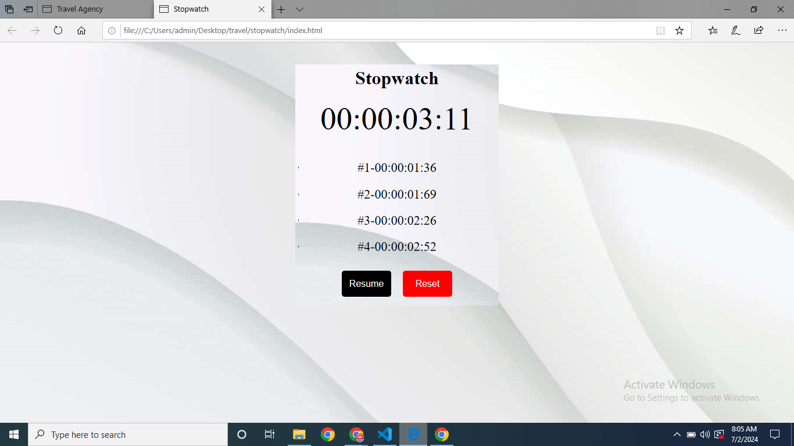

# Project README

This project was given by Prodigy Infotech as Task 2 in the domain Web Development.

## Description

This project is a Stopwatch Web Application. It will track and display the lap times which makes it as an interactive and user-friendly application. We can also Start,Pause,Reset,Restart the stopwatch.

Languages used: HTML, CSS, JavaScript

Website Link:https://stopwatch-1125.netlify.app/

  

## File Structure

- `index.html`: The main HTML file for the webpage.
- `styles.css`: Directory containing CSS stylesheets.
- `script.js`: Directory containing Javascript files.
- `screenshots.png`: The result of the task 2.
